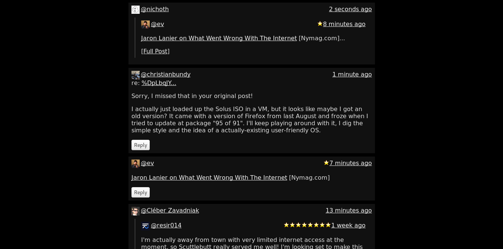

# mvd



This is a minimum viable full-stack Decent server and client. 

Or you can call it model/view/decent

`scuttlebot.js` is the model
`views.js` is the views
`index.js` is the controller
and
`render.js` renders posts

### getting started
```
npm install
npm run build
npm start
```

mvd should launch a browser window, and comes pre-configured to use the main ssb network by default. If you already have an `.ssb` folder, mvd should 'just work'.

To use with decent try `npm run decent`, to launch a testnet try `npm run testnet`.

[try it online](http://gitmx.com/) -- decent(ralized)

### history

`mvd` is coded from scratch, but may have some code overlap with [minbase](http://github.com/evbogue/minbase) and [patchless](http://github.com/dominictarr/patchless)

---
MIT
